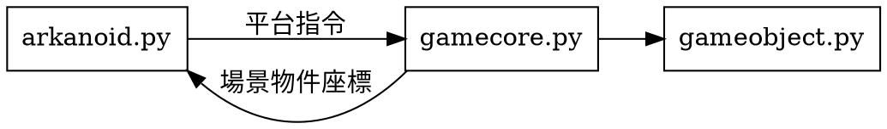

# MLGame-Arkanoid

2019年大二下學期「基於遊戲的機器學習入門」的第一個遊戲。
此頁面的資訊整理自https://hackmd.io/2BTv08WmReSx6mjNnVPyag?both

## 下載
https://github.com/LanKuDot/MLGame

版本為MLGame-beta2.2.2

## 座標系統
原點位在左上角，從遊戲傳出的物件座標也是物件左上角的點。往右為 x 正方向，往下為 y 正方向。


### 物件參數

* 場景大小：200 x 500
* 球：5 x 5，移動速度 (±7, ±7)。初始位置 (100, 100)，初始移動速度 (7, 7)，也就是一開始往右下角移動
* 平台：40 x 5，移動速度 (±5, 0)。初始位置 (75, 400)
* 磚塊：25 x 10。初始位置依關卡而定

GameOver：當球的位置一低於平台位置，遊戲結束。
Win：當打掉最後一個磚塊。

## 執行程式

```
python MLGame.py -f 24 -i ml_play.py arkanoid 3
```
* `-f`：遊戲運作的更新頻率fps設定成24，預設是 30 fps
* `-i`：指定要使用的機器學習程式碼檔名為ml_play.py，檔案必須放在對應遊戲的 `ml` 資料夾中，而且必須有 `ml_loop()` 函式。
* `arkanoid 3`：指定遊戲的第3關卡，檔案在..\arkanoid\gamelevel_data中，不指定則關卡預設為 1。

```
python MLGame.py -f 24 -m arkanoid 3
```
手動操作遊戲

```
python MLGame.py -f 24 -m arkanoid 3 -r
```
產生log file

```
python MLGame.py -h
```
顯示指令說明

## 程式架構


這個平台將程式分成 `game_process` 負責運行遊戲程式，與 `ml_process` 負責運行機器學習的程式，之間透過兩個單向的 pipe 傳遞資料。

玩家的機器學習主程式必須寫在 `games/arkanoid/ml/ml_play.py` 中的 `ml_loop()` 裡，主程式會以此為機器學習程式的進入點。

在 `ml_loop()` 中透過一個無限迴圈來接收場景資料與回傳遊戲指令。程式碼範例並沒有處特別處理收到的資訊：

```python=
import games.arkanoid.communication as comm
from games.arkanoid.communication import (
    GameStatus, PlatformAction, SceneInfo, GameInstruction
)

def ml_loop():
    comm.ml_ready()
    
    while True:
        scene_info = comm.get_scene_info()
        if scene_info.status == GameStatus.GAME_OVER or \
            scene_info.status == GameStatus.GAME_PASS:
            comm.ml_ready()
            continue
        comm.send_instruction(scene_info.frame, PlatformAction.MOVE_LEFT)
```
運作流程如下：

1. import 必要的 package（Line 1~4）
2. 撰寫 ml_loop()（Line 6）。主程式會呼叫這個函式以啟動機器學習端。
3. 告知遊戲端，機器學習端已經準備好了（Line 7）。如果有初始化的程式碼，就必須寫在這之前。
4. 讀取從遊戲端送過來的場景資料（Line 10）
5. 判定如果場景狀態為 `GAME_OVER` 或是 `GAME_PASS`，則再次告知遊戲端準備好下一輪了（Line 13）。因為遊戲端在遊戲結束或通關後，會立刻重設遊戲，並等待機系學習端準備好。因此可以在這之前對通關或是失敗做對應處理，例如：初始化、更新學習的資料。
6. 取得場景計算完成後，傳送指令到遊戲端（Line 15，範例只是單純的向左）
7. 回到第 4 步，等待讀取下一個 frame 的場景資訊

### 傳遞的資料結構

資料結構定義在 `games/arkanoid/communication.py` 中。

`SceneInfo` 為遊戲端傳給機器學習端的場景資料：

```python
class SceneInfo:
    def __init__(self, frame: int, status: str):
        self.frame = frame
        self.status = status
        self.ball = None        # tuple (x, y)
        self.platform = None    # tuple (x, y)
        self.bricks = None      # list of tuple (x, y)
```

* `frame`：目前遊戲運行了幾個 frame，從 0 開始
* `status`：遊戲的狀態，為 `GameStatus` 其中之一，分別為進行中（GAME_ALIVE）、過關（GAME_PASS）、失敗（GAME_OVER）
* `ball`、`platform`：球與平台的位置，為一個 tuple，第一個元素是 x 座標，第二個元素是 y 座標
* `bricks`：剩下的磚塊位置，為一個 list，每個元素都是 (x, y) tuple

如果將收到的場景資訊印出來如下：

```
# Frame 0        // 代表第 0 個 frame
# Status GAME_ALIVE
# Ball 1         // 球的座標。除了 Frame 的數字代表第幾個之外，其餘都是代表數量
100 100
# Platform 1
75 400
# Brick 5
35 50
60 50
85 50
110 50
135 50
```

則代表這個 `scene_info` 為：

```
scene_info.frame = 0
scene_info.status = GameStatus.GAME_ALIVE
scene_info.ball = (100, 100)
scene_info.platform = (75, 400)
scene_info.bricks = [(35, 50), (60, 50), (85, 50), (110, 50), (135, 50)]
```

而 `GameInstruction` 是機器學習端要傳給遊戲端的遊戲指令：

```python
class GameInstruction:
    def __init__(self, frame: int, command: str):
        self.frame = frame
        self.command = command
```

* frame：遊戲場景的 frame，作為對時用。`game_process` 中會印出遊戲目前的 frame 與收到的指令 frame，幫助判斷機器學習是否跟不上遊戲 process
    * console 會輸出這樣的訊息：`Frame: 3/3 Cmd: LEFT`。`3/3` 代表 `遊戲目前的 frame/收到的指令的 frame`，這兩個值應該要相等。
* command：平台移動指令，為 `PlatformAction` 其中之一，往左（MOVE_LEFT）、往右（MOVE_RIGHT）、不動（NONE）

## 遊玩過程紀錄檔

在執行遊戲時，如果有指定 `-r` 或 `--record` flag 的話，遊玩過程中會記錄每個 frame 的狀態，為一個 list，儲存每個 frame `SceneInfo`。在遊戲通關或是結束時，會使用 pickle package 產生檔案，儲存在該遊戲的 log 資料夾下，如 `games/arkanoid/log`。在讀取檔案時只要指定路徑到那個檔案就好了。

## 執行時序


注意 `game_process` 並不會等到有 `GameInstruction` 才會繼續執行，而是固定時間檢查一次（依照設定的 FPS）。在 `game_process` 中會檢查 `GameInstruction.frame` 是不是跟目前的 frame 相符，以決定要不要執行（在目前的程式中會印出 game 中的 frame 與收到的指令）。

### 遊戲的結束

當遊戲過關或結束時，game 在傳送 `SceneInfo` 後會立刻重設場景，並等待機器學習端再次傳送準備好的指令。因此機器學習端可以藉此先更新自己需要的資料，再傳送準備好的指令。

## 遊戲核心

### 執行迴圈

遊戲內的執行順序如下：

1. 讀取控制平台指令
2. 更新球位置（參數：自身的移動速度）
3. 更新平台位置（參數：控制平台指令）
4. 檢查球與平台或牆面的碰撞，球反彈
5. 檢查球與磚塊的碰撞，球反彈，磚塊消滅
6. 回傳所有場景中的物件座標

### 程式架構

* 架構圖

* **`arkanoid.py`：** 遊戲啟動點，設定啟動模式與參數
* **`gamecore.py：`** 管理場景，控制遊戲流程，傳送指令給對應物件，並回傳物件座標
* **`gameobject.py：`** 遊戲物件邏輯，依照事件或指令執行動作，處理物件之間的事件
    * 必要可時可以回傳處理結果 (像是在這個 frame 中消滅了幾個磚塊)，讓 gamecore 可以做計分或是判定 game over
